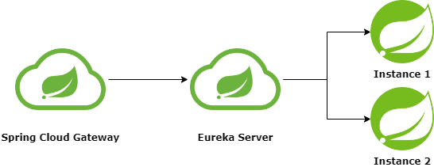

# 쿠폰 발급 동시성 제어 (Redis)
분산 환경에서 동시성을 제어하기 위해 Redis를 사용한 코드입니다.

위 이미지와 같은 아키텍처로 구성되어 있습니다.  
사용을 위해서는 Eureka Service > gateway > Redis Distributed Lock 순으로 실행하면 됩니다.

실행을 위해서 Redis와 Mysql이 설치되어 있고 실행 가능한 상태여야 합니다.

관련 포스트는 [여기](https://velog.io/@cutepassions/Redis의-분산-락을-이용한-동시성-제어)에서 확인할 수 있습니다.
